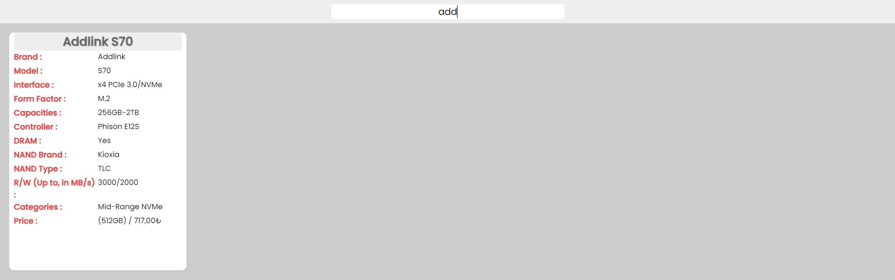

# M2 SSD Spec Finder App

- I made this project because I couldn't find enough information about SSDs.
- When I find them, they are not well organized. 
- And when you try to find the right SSD for yourself, they don't bring the right specs to you.
- Those are the issues we faced when trying to find a good SSD.
- That's why I made this M2 SSD Finder.
---

- First, I know my color palette is fire. No problem I will work on that ;) It's so hard to pick the right color :(

- Now let me show you the features.

## Feature 1

- You can search for SSDs, and this section will bring you the results.

- There's no need to be concerned about uppercase or lowercase letters or the exact name of the SSD. 

- It will automatically find what you typed, and if the database includes what you typed, it will bring it to you.

Like this:

### Things That I Want to add

- More M2 and Sata SSDs.
- (A to Z) and (Z to A) Sort system.
- Better colour selection :)
- Sorting system for all aspects.

`End of the readme`